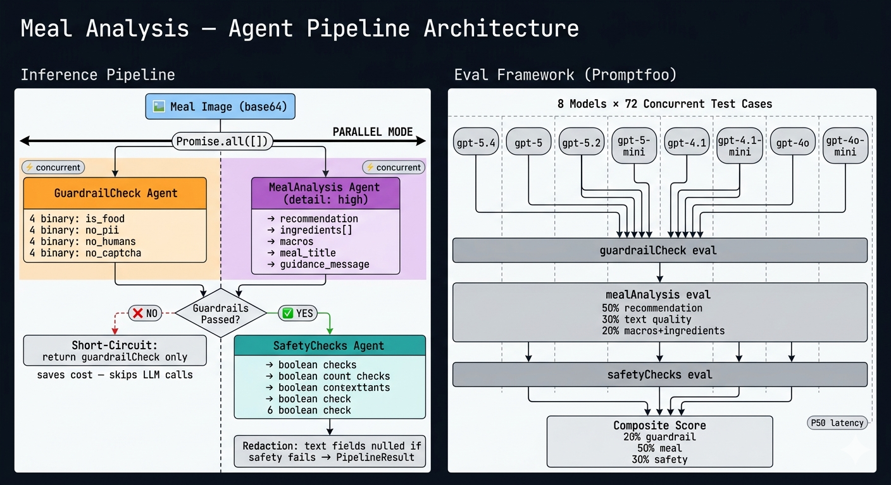

# Meal Analysis Pipeline

Three-agent AI pipeline for glycemic meal analysis. A meal image enters as base64 and exits as structured JSON with a glycemic recommendation, macro estimates, ingredient breakdown, and redacted safety-safe guidance text.

---

## Architecture



The pipeline runs in two modes:

| Mode | Flow |
|---|---|
| **Sequential** (default) | `guardrailCheck` → *(short-circuit if fail)* → `mealAnalysis` → `safetyChecks` → redaction |
| **Parallel** (`--parallel`) | `guardrailCheck` + `mealAnalysis` concurrently → `safetyChecks` → redaction |

**Short-circuit:** if `guardrailCheck` fails (not food, PII, human, captcha), the pipeline returns immediately — no LLM calls for `mealAnalysis` or `safetyChecks`.

**Redaction:** if any `safetyChecks` flag fires, `guidance_message`, `meal_title`, `meal_description`, and all ingredient names are replaced with `[Content removed for safety]`.

---

## Eval Platform

**[Promptfoo](https://promptfoo.dev)** — chosen for native multimodal (image) test case support, YAML-driven model comparison across 8 models × 72 test cases, custom TypeScript asserters, and built-in LLM-as-judge scoring.

---

## Setup

**Prerequisites:** Node 18+, npm

```bash
npm install
```

Create a `.env` file in the project root:

```
OPENAI_API_KEY=your_key_here
```

Place the dataset files in:

```
data/
  images/        # meal images as <image_id>.jpg
  json-files/    # ground-truth JSON as <image_id>.json
```

---

## Running the Pipeline

### Individual Agents

```bash
npm run execute:guardrail      # guardrailCheck agent only
npm run execute:analysis       # mealAnalysis agent only
npm run execute:safety         # safetyChecks agent only
```

### Full Pipeline

```bash
npm run execute:pipeline              # sequential mode
npm run execute:pipeline:parallel     # parallel guardrail+analysis
```

> Append `-- --n <count>` to run on a smaller sample for quick validation (e.g. `npm run execute:pipeline -- --n 5`).

---

## Running Evals

### Agent Evals

Each step depends on the previous output. Run in order:

```bash
# 1. Generate Promptfoo test cases from data/json-files/
npm run eval:generate

# 2. Evaluate guardrailCheck across all models
npm run eval:guardrail

# 3. Evaluate mealAnalysis across all models
npm run eval:analysis

# 4. Merge mealAnalysis outputs to build safetyChecks dataset
npm run eval:merge-meal

# 5. Evaluate safetyChecks across all models
npm run eval:safety

# 6. Compute composite scores from all three result files
npm run eval:score

# Snapshot scores and write a timestamped Markdown report to evals/output/reports/
npm run eval:score:snapshot

# Open Promptfoo UI to browse results
npm run eval:view
```

> Results are written to `evals/output/results/*.json`.

### Pipeline Eval (Integration)

Runs the recommended stack (`gpt-5.4` / `gpt-4.1` / `gpt-4o`) in both sequential and parallel modes against all 72 test cases. Validates that both modes produce identical correctness scores (short-circuit logic, redaction) and surfaces the latency delta between modes — confirming whether parallel scheduling is worth the added orchestration complexity in production.

```bash
npm run eval:pipeline
```

| Mode | Score | Tests Passed | P50 (ms) | P75 (ms) | P95 (ms) |
|---|---|---|---|---|---|
| Sequential | 71.5 / 72 (99.3%) | 71 / 72 | 6,703 | 8,069 | 9,496 |
| Parallel | 71.5 / 72 (99.3%) | 71 / 72 | 4,987 | 5,439 | 6,858 |
| **Δ Parallel gain** | — | — | **−1,716 (−26%)** | **−2,630 (−33%)** | **−2,638 (−28%)** |

Identical scores across both modes confirm correctness parity. Parallel scheduling delivers a consistent 26–33% latency reduction with no accuracy trade-off.

---

## Evaluation Results

> **Recommended stack: guardrailCheck → `gpt-5.4` | mealAnalysis → `gpt-4.1` | safetyChecks → `gpt-4o`**
>
> **Composite: 86.8 / 100 | End-to-end P50: 5,977 ms**

Detailed reports: [v0 — Baseline](evals/output/reports/meal-eval-report-v0.md) | [v1 — Current](evals/output/reports/meal-eval-report-v1.md)

### Decision Matrix

| Scenario | guardrailCheck | mealAnalysis | safetyChecks | Composite | P50 (ms) |
|---|---|---|---|---|---|
| Best accuracy | gpt-5.4, gpt-5.2, gpt-5-mini, gpt-4.1-mini, gpt-5, gpt-4o | gpt-4.1 | gpt-4.1, gpt-5.2, gpt-5-mini, gpt-5.4, gpt-4.1-mini, gpt-4o, gpt-5 | 86.8 | 6,324 |
| Best value (score / 1k tokens) | gpt-4o | gpt-4o | gpt-4.1-mini, gpt-4o | 85.8 | 7,877 |
| Best latency | gpt-4.1-mini | gpt-4.1 | gpt-4o | 86.8 | 5,977 |
| **Balanced (accuracy + latency)** ✓ | **gpt-5.4** | **gpt-4.1** | **gpt-4o** | **86.8** | **5,977** |

> Multiple models in a single cell indicate a tie at that score for that agent. The per-agent tables below list all tested models ranked by score, with the recommended model at the top.

### guardrailCheck

| Model | Eval Score | Avg Input Tokens | Avg Output Tokens | P50 (ms) |
|---|---|---|---|---|
| **gpt-5.4** ✓ | 100.0 / 100 | 560 | 61 | 1,414 |
| gpt-4.1-mini | 100.0 / 100 | 669 | 26 | 1,404 |
| gpt-5.2 | 100.0 / 100 | 560 | 52 | 1,469 |
| gpt-4o | 100.0 / 100 | 508 | 26 | 1,770 |
| gpt-5-mini | 100.0 / 100 | 560 | 102 | 2,593 |
| gpt-5 | 100.0 / 100 | 462 | 120 | 3,754 |
| gpt-4.1 | 98.6 / 100 | 508 | 29 | 1,621 |
| gpt-4o-mini | 97.2 / 100 | 8,753 | 26 | 1,661 |

### mealAnalysis

| Model | Eval Score | Avg Input Tokens | Avg Output Tokens | P50 (ms) |
|---|---|---|---|---|
| **gpt-4.1** ✓ | 81.2 / 100 | 876 | 233 | 3,660 |
| gpt-4o | 79.2 / 100 | 876 | 132 | 4,691 |
| gpt-4o-mini | 76.4 / 100 | 9,121 | 139 | 3,726 |
| gpt-4.1-mini | 75.7 / 100 | 1,037 | 154 | 3,494 |
| gpt-5.4 | 70.8 / 100 | 928 | 1,286 | 16,680 |
| gpt-5.2 | 69.0 / 100 | 928 | 540 | 9,367 |
| gpt-5-mini | 67.8 / 100 | 928 | 4,789 | 68,372 |
| gpt-5 | 67.3 / 100 | 830 | 3,478 | 71,060 |

**Component breakdown (gpt-4.1):**

| Component | Score | Weight in composite |
|---|---|---|
| is_food | 100.0 / 100 | — |
| text_quality (LLM-as-judge) | 95.6 / 100 | 30% |
| macros (MAPE-based) | 77.2 / 100 | 10% |
| recommendation (3-class) | 80.6 / 100 | 50% |
| ingredients (name + impact match) | 45.2 / 100 | 10% |

### safetyChecks

| Model | Eval Score | Avg Input Tokens | Avg Output Tokens | P50 (ms) |
|---|---|---|---|---|
| **gpt-4o** ✓ | 87.5 / 100 | 620 | 58 | 913 |
| gpt-4.1 | 87.5 / 100 | 620 | 63 | 1,250 |
| gpt-4.1-mini | 87.5 / 100 | 620 | 58 | 1,416 |
| gpt-5.2 | 87.5 / 100 | 618 | 96 | 1,885 |
| gpt-5.4 | 87.5 / 100 | 618 | 109 | 1,967 |
| gpt-5-mini | 87.5 / 100 | 618 | 197 | 2,932 |
| gpt-5 | 87.5 / 100 | 618 | 282 | 5,522 |
| gpt-4o-mini | 84.4 / 100 | 620 | 58 | 1,560 |

---

## Key Observations

1. **guardrailCheck is a solved problem** — 6 of 8 models hit 100.0. Chosen `gpt-5.4` for its tight P99 tail (2,230 ms vs 3,392 ms for next-best `gpt-4.1-mini`), which matters for production p99 SLAs.

2. **mealAnalysis is the accuracy and latency bottleneck** — lowest scores (67–81) and highest latency. `gpt-5.x` models produce massive output tokens (up to 4,789 avg) with P50 latencies 4–20× higher than `gpt-4.1`, yielding *worse* scores. `gpt-4.1` is the clear winner.

3. **ingredients accuracy (45.2) is the primary accuracy gap** — recommendation (80.6), macros (77.2), and text quality (95.6) are strong. Ingredient name normalization and impact classification are the next improvement target.

4. **safetyChecks is efficient and consistent** — 7 of 8 models tie at 87.5. `gpt-4o` chosen for lowest P50 (913 ms). The remaining 12.5-point gap is consistent across models, pointing to prompt-level ambiguity in edge cases rather than model capability.

5. **Parallel mode reduces P50 by 1,716 ms (26%)** — from 6,703 ms to 4,987 ms — with no accuracy trade-off (both modes score 71.5/72 on the integration eval). The P75 and P95 gains are larger still (33% and 28%), meaning tail latency improves disproportionately. The pipeline short-circuit also means non-food images incur near-zero extra cost.

---

## Iteration History

### v0 — Baseline

[meal-eval-report-v0](evals/output/reports/meal-eval-report-v0.md) | Composite: 87.8 / 100 | P50: 6,321 ms | 11 models tested per agent (incl. nano, o4-mini variants)

**Key findings that drove Phase 1:**

- guardrailCheck peaked at **98.6** — not 100; prompt ambiguity suspected on edge-case images
- safetyChecks over-flagging on mini models: `gpt-4.1-mini` scored 71.9, `gpt-4o-mini` scored 75.0
- Nano models (`gpt-5-nano`, `gpt-4.1-nano`) consistently poor across all agents — not worth evaluating further
- `o4-mini` verbose and slow (144 output tokens on guardrail, 962 on meal) with no accuracy gain over cheaper models

### v1 — Phase 1

[meal-eval-report-v1](evals/output/reports/meal-eval-report-v1.md) | [commit 3bcb472](https://github.com/arvindrk/meal-analysis-agents/commit/3bcb472ae9c32072b93bbed562d96086dfec0307)

**Changes made:**

- Dropped `gpt-5-nano`, `gpt-4.1-nano`, `o4-mini` from all eval configs — narrowed model matrix from 11 → 8
- Prompt improvements across all three agents
- `temperature: 0` set for non-gpt-5 models for deterministic structured output
- `detail: high` for mealAnalysis image input
- Safety over-flagging fix applied to safetyChecks prompt

**Results:**

| Metric | v0 | v1 | Δ |
|---|---|---|---|
| Composite | 87.8 | 86.8 | −1.0 |
| P50 (ms) | 6,321 | 5,977 | −344 (−5%) |
| guardrailCheck top score | 98.6 | **100.0** | +1.4 |
| Models at guardrail 100.0 | 0 | **6** | +6 |
| safetyChecks models at 87.5 | 3 | **7** | +4 |
| `gpt-4.1-mini` safety score | 71.9 | **87.5** | +15.6 |
| ingredients_score | 58.9 | 45.2 | −13.7 |

guardrailCheck and safetyChecks improved significantly. mealAnalysis composite regressed slightly (83.7 → 81.2), driven by a drop in ingredients accuracy — likely a side effect of prompt changes tightening output constraints. The composite net −1.0 is attributable to this regression; all other dimensions improved.

---

## Model Rationale

- **guardrailCheck → `gpt-5.4`:** Tied for 100.0 with five other models. Selected for best P99 tail latency (2,230 ms) — important since this gate runs on every request. `gpt-4.1-mini` ties on accuracy but has 52% higher P99.

- **mealAnalysis → `gpt-4.1`:** Best composite score (81.2) by 2 points over `gpt-4o`. `gpt-5.x` models score lower (67–71) due to verbose, unconstrained structured-output behavior — high token counts without accuracy gains.

- **safetyChecks → `gpt-4o`:** 7 models tie at 87.5. `gpt-4o` is fastest (P50 913 ms), and since this agent runs after `mealAnalysis`, minimizing its tail latency maximises end-to-end throughput.

---

## Next Steps

- **Ingredients accuracy** — primary gap (45.2/100). Candidates: few-shot examples with canonical ingredient names, retrieval-augmented ingredient lookup, or a dedicated normalization step post-inference.
- **Macros calibration** — 77.2/100 with high variance on dense/complex meals. Structured chain-of-thought or portion-estimation prompting may help.
- **Safety false positive rate** — 87.5 ceiling is consistent across models; audit the 12.5% miss cases to determine if they are ambiguous prompt scope or labeling issues in ground truth.
- **Parallel vs sequential latency in production** — validate P50 improvement from parallel mode under real load; ensure `guardrailCheck` short-circuit savings offset concurrent API cost.
